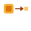

## Studying/Learning

 [from-zero-to-systems](https://github.com/michaelmillar/from-zero-to-systems) Build increasingly complex Rust applications, from probability engines to distributed consensus.

 [desugar](https://github.com/michaelmillar/desugar) Build a programming language from scratch and learn compilers.

## Applications/Tools

 [baton](https://github.com/michaelmillar/baton) Deploy apps, not infrastructure. A radically simpler alternative to Kubernetes.

 [strunk](https://github.com/michaelmillar/strunk) Omit needless infrastructure. Transactional task queues and change feeds backed by Postgres.
