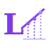

## Research

 [matscreen](https://github.com/michaelmillar/matscreen) Uncertainty-aware materials screening. Pareto-ranked candidates with calibrated confidence intervals.

 [calibench](https://github.com/michaelmillar/calibench) Calibration metrics and diagnostics for uncertainty quantification.

 [pareto-front](https://github.com/michaelmillar/pareto-front) Fast multi-objective Pareto sorting for Python.

 [atomviz](https://github.com/michaelmillar/atomviz) Crystal structure visualisation in SVG and HTML. No GPU, no desktop app.

## Infra

 [pg-blast-radius](https://github.com/michaelmillar/pg-blast-radius) Know what your PostgreSQL migration will do before you run it. Catalog-aware risk analysis with rollout plan generation.

 [baton](https://github.com/michaelmillar/baton) Deploy apps, not infrastructure. A radically simpler alternative to Kubernetes.

 [strunk](https://github.com/michaelmillar/strunk) Omit needless infrastructure. Transactional task queues and change feeds backed by Postgres.

## Study

 [lemma](https://github.com/michaelmillar/lemma) Learn mathematics through real-world problems. 52 problems across probability, linear algebra, calculus, and discrete maths.

 [from-zero-to-systems](https://github.com/michaelmillar/from-zero-to-systems) Build increasingly complex Rust applications, from probability engines to distributed consensus.

 [desugar](https://github.com/michaelmillar/desugar) Build a programming language from scratch and learn compilers.
